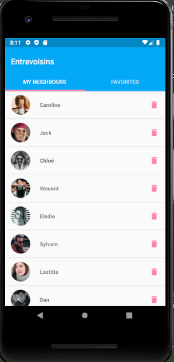
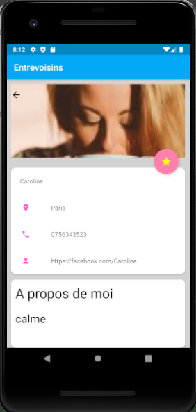
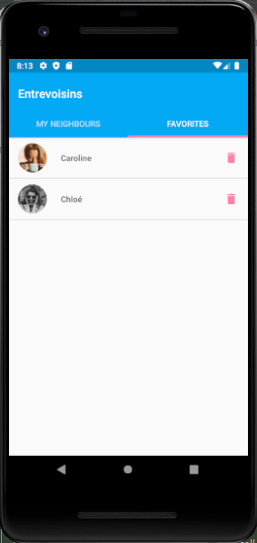

# OpenClassrooms

Ce dépôt contient une mini-application pour le P3 du parcours **Grande École du Numérique**.
# OC_PJ_EntreVoisins_APP

## Introduction
This is an android application made in the context of the 4th project of the OpenClassroom's Android development training

## Description
"EntreVoisins" allows the user to 
* List his neighbours
* Add a new neighbour to the list
* Remove a neighbour from the list

On click on a neighbour, it shows
* The neighbour's name
* His location
* His phone number and facebook account

On click on the favorite button (The star icon) 
* The neighbour is added to favorite list
* Reclick the button to remove the neighbour from the favorite list

To show the favorite neighbours list, click on the left right tab of the first screen (FAVORITES)

## Launch 
Programming language: JAVA 

To run the application using an adnroid emulator
* Clone or download
* Download zip
* Unzip the repository 
* Open the project using android studio
* Install and configure a new emulator with an API 28
* Run the application

To run the application in a real android device
* Clone or download
* Download zip
* Unzip the repository
* Open the project using android studio
* Connect the android device to android studio using an USB cable (Device's developer mode should have been already activated) 
* Select the device and run the application

## Test 
4 local unit tests to run in the JVM 
* test: getNeighboursWithSucces
* test: deleteNeighbourWithSuccess
* test: addAndRemoveFromFavoriteListWithSuccess
* test: getFavoriteListWithSuccess

5 Instrumented unit tests to run in an android emulator/android device 
* test: myNeighboursList_shouldNotBeEmpty
* test: myNeighboursList_deleteAction_shouldRemoveItem
* test: checkIfDetailsActivityIsLaunched
* test: checkIfNeighbourNameIsFilled
